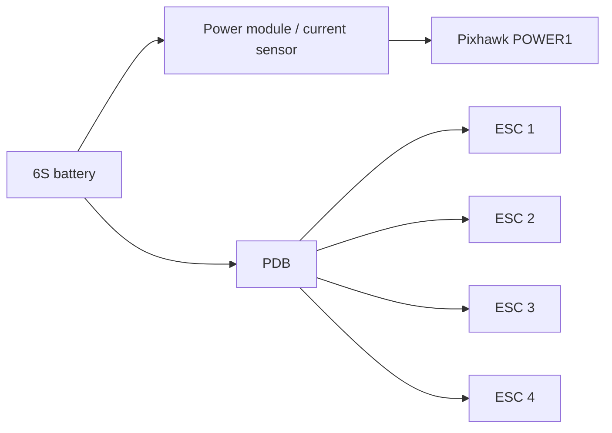
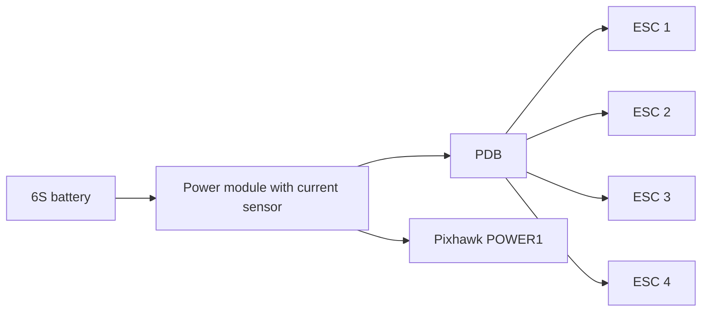
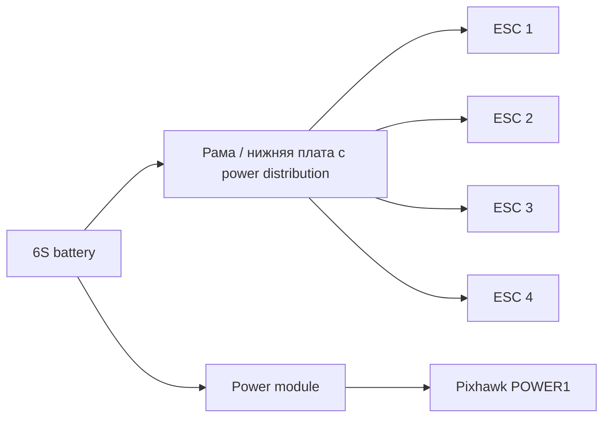

# Как выбирать PDB и power module для MVP

Источник: [[Комплектующие MVP]], [[Схема подключения MVP]], [[Выбор компонентов/Как выбирать аккумулятор для MVP|Как выбирать аккумулятор для MVP]], [[Выбор компонентов/Как выбирать ESC для MVP|Как выбирать ESC для MVP]], [[Выбор компонентов/Как выбирать Flight Controller для MVP|Как выбирать Flight Controller для MVP]]

## Главный принцип

В коптере есть две разные задачи питания:

1. Распределить большой силовой ток от аккумулятора на ESC.
2. Безопасно запитать Pixhawk и измерять напряжение/ток батареи.

Эти задачи могут решаться разными компонентами или одной комбинированной платой.

## Что такое PDB

`PDB` — Power Distribution Board, плата распределения питания.

Её задача:

`аккумулятор → PDB → ESC 1/2/3/4 → моторы`

PDB работает с большим током. Через неё проходит силовое питание моторов.

PDB может быть:

- отдельной платой;
- встроенной в нижнюю плату рамы;
- частью power distribution hub;
- заменена аккуратной силовой разводкой проводами;
- совмещена с power module/current sensor.

## Что такое power module

`Power module` — модуль питания автопилота.

Его задачи:

- выдать стабильные 5V на Pixhawk;
- измерять напряжение батареи;
- измерять ток батареи;
- передавать эти данные в ArduPilot через `POWER1`;
- дать основу для battery monitor и battery failsafe.

Для Pixhawk 6C Mini нормальная схема:

`аккумулятор → power module → POWER1 Pixhawk`

Pixhawk нельзя питать напрямую от 6S батареи.

## Почему PDB и power module не одно и то же

| Компонент | Что делает | Через него идёт ток моторов? | Подключается к Pixhawk |
|---|---|---:|---|
| PDB | Раздаёт силовое питание на ESC | да | обычно нет |
| Power module | Питает Pixhawk и измеряет батарею | иногда да, если стоит в силовой цепи | да, в `POWER1` |
| BEC ESC | Может дать 5V | нет, только питание электроники | лучше не использовать для Pixhawk |

Иногда power module стоит между аккумулятором и всей силовой системой, поэтому через него проходит общий ток. В этом случае его current sensor должен выдерживать суммарный ток коптера.

## Возможные схемы

### Вариант 1 — power module + отдельная PDB

Плюсы:

- простая логика;
- PDB можно выбрать под нужный ток;
- power module отвечает только за Pixhawk и измерения, если токовый датчик включён правильно.

Минусы:

- больше проводов;
- нужно аккуратно понять, где именно измеряется ток батареи.

### Вариант 2 — power module в силовой цепи перед PDB

Плюсы:

- Pixhawk видит общий ток батареи;
- удобно для battery monitor;
- часто так устроены готовые Pixhawk power modules.

Минусы:

- power module должен выдерживать весь суммарный ток моторов;
- разъёмы power module должны подходить по току;
- если модуль слабый, он станет узким местом.

### Вариант 3 — рама со встроенным распределением питания

Плюсы:

- меньше отдельной проводки;
- аккуратная сборка;
- часто удобно для X500/F450/F550-рам.

Минусы:

- нужно проверить токовый рейтинг платы рамы;
- не всегда понятно качество дорожек и пайки;
- может быть неудобно менять разъёмы.

## Что нужно для Pixhawk 6C Mini

Для Pixhawk 6C Mini нужно:

- стабильные 5V на `POWER1`;
- поддержка 6S батареи: полный заряд 25.2 В;
- измерение напряжения батареи;
- измерение тока батареи;
- кабель с правильным JST-GH разъёмом под `POWER1`;
- корректные параметры battery monitor в ArduPilot.

Если покупается `Pixhawk 6C Mini kit`, нужно проверить, какой power module входит в комплект: например PM02/PM06/другой, какие у него разъёмы и какой допустимый ток.

## Как считать токовый запас

Суммарный максимальный ток:

`I_total_max = I_motor_max × 4`

Пример:

- max current одного мотора: 30 A;
- 4 мотора;
- суммарно: `30 × 4 = 120 A`.

Значит, всё в силовой цепи должно выдерживать этот уровень с запасом:

- PDB;
- power module, если через него идёт силовой ток;
- разъём аккумулятора;
- провода;
- пайка;
- anti-spark / выключатель, если используется.

Практический запас:

- для первых оценок держать минимум 20-30%;
- если расчёты неточные или компоненты с AliExpress, запас лучше больше.

Если hover-ток всего коптера 40-60 A, а максимальный расчётный ток 100-140 A, PDB и разъёмы нужно выбирать по максимальному току, а не по hover.

## Разъёмы

Типичные разъёмы:

| Разъём | Где уместен | Комментарий |
|---|---|---|
| XT60 | средние токи | может быть на границе для тяжёлого 6S-коптера |
| XT90 | более спокойный вариант для 6S MVP | предпочтительнее, если токи растут |
| XT90-S anti-spark | 6S с меньшей искрой при подключении | полезно для больших батарей |
| EC5 | крупные RC-сборки | тоже нормальный вариант |
| AS150 | heavy-lift | избыточно для первого MVP |

Для текущего MVP `XT90` или `XT90-S` выглядит спокойнее, чем `XT60`, если power module и батарея доступны с таким разъёмом.

Но если в Pixhawk kit идёт power module с XT60, нужно проверить его токовый рейтинг. Возможно, для лёгкого первого MVP он допустим, но для будущего payload лучше заранее понимать ограничение.

## Провода

Проверить:

- сечение проводов от батареи к PDB/power module;
- длину силовых проводов;
- качество пайки;
- термоусадку;
- защиту от перетирания;
- фиксацию проводов на раме;
- удаление силовых проводов от GPS/compass и слабосигнальных линий.

Слишком тонкий провод греется, создаёт просадку напряжения и может стать причиной отказа.

## BEC от ESC

У выбранных EMAX BLHeli ESC может быть UBEC.

Для Pixhawk-сборки правило такое:

- Pixhawk питается через `POWER1` от power module;
- BEC от ESC не использовать как основное питание Pixhawk;
- красные 5V-провода от ESC signal cable не объединять без понимания схемы;
- signal и GND от ESC к Pixhawk нужны, чтобы был общий reference для PWM-сигнала.

## Предохранитель и anti-spark

Для первого MVP предохранитель не всегда ставят, но стоит понимать риски.

Что можно рассмотреть:

- anti-spark разъём `XT90-S`;
- качественный главный разъём батареи;
- физически доступное отключение питания;
- аккуратную укладку проводов без риска перетирания;
- предохранитель или current limiter для наземных тестов, если есть опыт.

Главное: не делать “выключатель” на слабом тумблере, через который пойдёт весь ток моторов. Обычные маленькие тумблеры не рассчитаны на такие токи.

## Что проверить в комплекте Pixhawk 6C Mini kit

Перед покупкой/сборкой:

1. Какой power module входит в kit?
2. Поддерживает ли он 6S?
3. Какой у него максимальный ток?
4. Какой разъём батареи: XT60/XT90/другой?
5. Есть ли кабель в `POWER1` Pixhawk 6C Mini?
6. Можно ли через него измерять общий ток всех моторов?
7. Нужна ли отдельная PDB, или рама уже распределяет питание?
8. Совместимы ли разъёмы power module, батареи и PDB?
9. Хватит ли места в раме для power module и силовой разводки?
10. Как настроить battery monitor в ArduPilot под этот модуль?

## Предварительная рекомендация для MVP

Для текущего проекта:

- power module брать из `Pixhawk 6C Mini kit`, если он поддерживает 6S и нужный ток;
- PDB использовать отдельную или встроенную в раму, в зависимости от выбранной X500-рамы;
- токовый рейтинг PDB/разводки считать по максимуму моторов, а не по hover;
- целиться в `XT90` / `XT90-S`, если это не конфликтует с kit-комплектом;
- Pixhawk питать только через `POWER1`, не через ESC BEC;
- перед первым полётом настроить и проверить battery monitor в Mission Planner.

## Чеклист перед покупкой PDB / power module

1. Нужна ли отдельная PDB, или она уже есть в раме?
2. Поддерживает ли power module 6S?
3. Какой максимальный ток power module?
4. Какой максимальный ток PDB?
5. Хватит ли 20-30% запаса по току?
6. Какой разъём батареи?
7. Совместимы ли разъёмы батареи, power module и PDB?
8. Есть ли кабель `POWER1` под Pixhawk 6C Mini?
9. Можно ли измерять общий ток батареи?
10. Есть ли место и понятная схема крепления на раме?

Не покупать PDB/power module только по названию “для Pixhawk” или “для 6S”. Нужно проверить ток, разъёмы и реальную схему включения.
