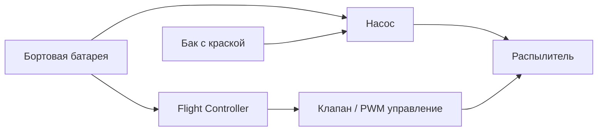

# Концепция 1 — всё на борту коптера

Источник: [[Техническое задание]]

## Суть концепции

Вся система покраски находится на коптере:

- бак с краской;
- насос;
- распылитель;
- питание системы распыления;
- управляющая электроника клапана/насоса.

Коптер является полностью автономной покрасочной единицей и не связан с землёй шлангами или кабелями.

## Логическая схема

## Преимущества

- Полная мобильность без шланга.
- Нет внешних механических сил от кабеля или шланга.
- Простая эксплуатационная схема: взлетел, покрасил, сел.
- Удобно тестировать на небольших объектах.
- Теоретически лучше подходит для сложных траекторий вокруг объекта.

## Недостатки

- Масса краски быстро съедает полезную нагрузку.
- Короткое время полёта.
- Центр масс меняется по мере расхода краски.
- Требуются более мощные моторы и батарея.
- Чем тяжелее аппарат, тем сильнее prop wash возле стены.
- Повышенный риск при аварии: на борту одновременно батарея, краска, насос и механика распыления.

## Главные инженерные риски

### 1. Рост массы

Даже небольшой бак становится критичной нагрузкой для X500-класса. Например, 1 литр водной краски — это примерно 1–1.3 кг без учёта бака, насоса, трубок и креплений.

### 2. Стабилизация возле стены

Тяжёлый коптер с большими пропеллерами будет сильнее взаимодействовать с отражённым потоком от поверхности.

### 3. Смещение центра масс

По мере расхода краски масса бака меняется. Если бак расположен не идеально в центре, полётные характеристики будут дрейфовать.

## Что нужно исследовать

- Максимальная допустимая полезная нагрузка выбранной рамы.
- Время hover при разных массах.
- Безопасное расположение бака относительно центра масс.
- Минимальный объём краски, при котором концепция имеет смысл.
- Влияние распыления на устойчивость.

## Предварительный вывод

Концепция привлекательна простотой эксплуатации, но плохо подходит для первого MVP. Её стоит рассматривать как отдельный эксперимент после того, как базовая платформа уже стабильно летает и есть фактические данные по запасу тяги, времени полёта и поведению возле стены.

Статус: перспективная, но не базовая для MVP.
