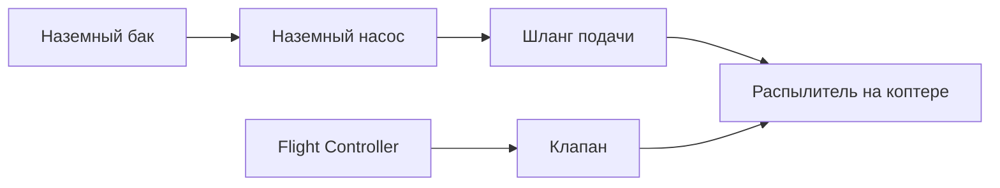

# Концепция 2 — краска и насос на земле

Источник: [[Техническое задание]]

## Суть концепции

На земле остаются тяжёлые элементы системы покраски:

- бак с краской;
- насос;
- основное давление подачи.

На коптере находятся только лёгкие элементы:

- распылитель;
- клапан;
- короткий участок трубки;
- минимальная управляющая электроника.

Краска подаётся к коптеру по гибкому шлангу.

## Логическая схема

## Преимущества

- Значительно меньше масса коптера.
- Можно использовать большой объём краски на земле.
- Легче добиться нормального времени полёта.
- Проще обслуживать бак и насос.
- Реалистичнее для ранних экспериментов с распылением.
- Можно сначала тестировать водой без изменения основной платформы.

## Недостатки

- Шланг создаёт внешнюю силу на коптер.
- Нужно учитывать натяжение, изгиб и вес шланга.
- Шланг может цепляться за препятствия.
- Движение ограничено длиной и маршрутом шланга.
- Требуется наземный оператор или система управления шлангом.

## Главные инженерные риски

### 1. Компенсация шланга

Шланг будет создавать переменную силу, особенно при движении вдоль стены и изменении высоты. Это может мешать position hold и wall following.

### 2. Запаздывание подачи

Длинный шланг создаёт задержку между включением клапана/насоса и фактическим изменением потока на форсунке.

### 3. Пульсации давления

Насос может давать пульсации, которые повлияют на равномерность распыла.

## Что нужно исследовать

- Минимальный диаметр и масса шланга для нужного flow rate.
- Требуемое давление на распылителе.
- Длина шланга для тестового стенда.
- Механизм разгрузки шланга: подвес, катушка, направляющая, ассистент.
- Управление клапаном на борту коптера.
- Влияние шланга на полёт без распыления.

## MVP-подход

Для первого этапа эта концепция не нужна: базовый коптер должен летать без шланга и payload.

Для этапа имитации распыления можно сделать облегчённую версию:

1. коптер несёт только mock nozzle и клапан;
2. вместо краски используется вода;
3. шланг подвешивается или разгружается;
4. сначала тестируется влияние шланга без включённой подачи;
5. затем включается подача и измеряется влияние spray на стабилизацию.

## Предварительный вывод

Это наиболее реалистичная архитектура для перехода от летающего MVP к покрасочным экспериментам. Она сохраняет коптер относительно лёгким и позволяет вынести самые тяжёлые и грязные элементы на землю.

Статус: главный кандидат для первого рабочего прототипа покраски.
