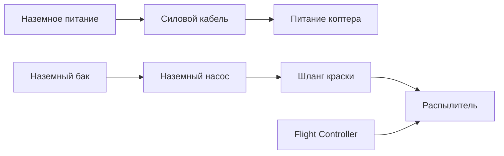

# Концепция 3 — краска, насос и питание на земле

Источник: [[Техническое задание]]

## Суть концепции

С земли подаются и краска, и электропитание. На коптере остаются:

- двигатели;
- flight controller;
- распылитель;
- минимальная электроника управления.

Коптер превращается в привязанную платформу с потенциально длительным временем работы.

## Логическая схема

## Преимущества

- Минимальная масса расходников на борту.
- Потенциально очень длительное время работы.
- Можно использовать мощный наземный насос.
- Удобно для повторяющихся работ на одном фасаде.
- Батареи не ограничивают длительность миссии так сильно, как в автономных вариантах.

## Недостатки

- Силовой кабель тяжёлый и опасный.
- Требуется управление одновременно шлангом и кабелем.
- Усложняется безопасность: высокие токи, подвес кабеля, возможные зацепы.
- Мобильность ниже, чем у батарейной системы.
- Сложнее полевые испытания.
- Требуется продуманная наземная станция.

## Главные инженерные риски

### 1. Кабельная механика

Кабель питания может быть тяжелее и жестче, чем шланг подачи краски. Он создаёт значительную внешнюю силу и может резко менять поведение коптера.

### 2. Электробезопасность

Работа рядом с фасадами, металлоконструкциями, влагой и распыляемой жидкостью требует отдельного анализа безопасности.

### 3. Отказоустойчивость

При потере питания или зацепе кабеля сценарии аварии сложнее, чем у обычного батарейного коптера.

## Что нужно исследовать

- Рабочее напряжение наземного питания.
- Масса кабеля на метр при требуемой мощности.
- Нужен ли бортовой буферный аккумулятор.
- Механизм аварийного отделения или разгрузки кабеля.
- Система подвеса/катушки для кабеля и шланга.
- Безопасные режимы посадки при проблемах с питанием.

## Предварительный вывод

Концепция потенциально полезна для промышленной версии, но слишком сложна и рискованна для раннего MVP. Её стоит держать как долгосрочное направление после проверки полёта возле стены и наземной подачи краски без силового кабеля.

Статус: промышленная/долгосрочная концепция, не для первого прототипа.
