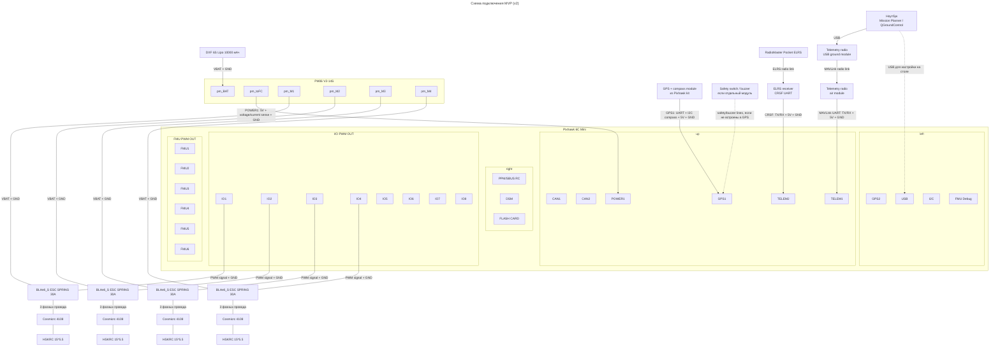
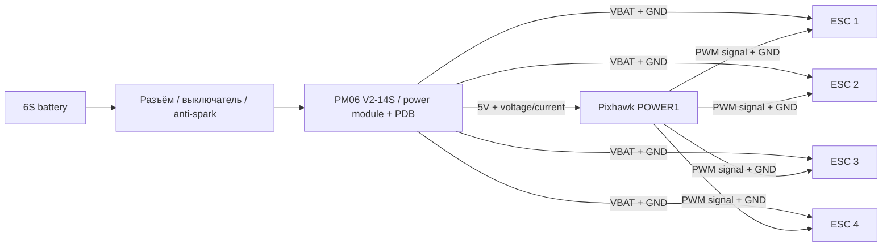
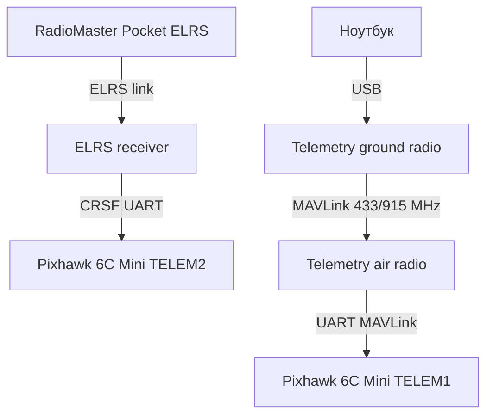

# Схема подключения MVP

Источник: [[Комплектующие MVP]], [[Выбор компонентов/Как выбирать Flight Controller для MVP|Как выбирать Flight Controller для MVP]], [[Выбор компонентов/Как выбирать управление и связь для MVP|Как выбирать управление и связь для MVP]], [[Выбор компонентов/Как выбирать ESC для MVP|Как выбирать ESC для MVP]], [[Выбор компонентов/Как выбирать аккумулятор для MVP|Как выбирать аккумулятор для MVP]]

Контроллер: `Pixhawk 6C Mini`.

Формат схемы: Mermaid. Он удобен для Obsidian, потому что диаграмма хранится прямо в Markdown и её легко менять по мере выбора компонентов.

## Общая схема

## Подключения к Pixhawk 6C Mini

| Узел | Порт Pixhawk 6C Mini | Что подключается | Комментарий |
|---|---|---|---|
| Power module | `POWER1` | 5V питание контроллера, voltage/current sense, GND | Pixhawk не питать напрямую от 6S. Через power module также настраивается battery monitor в ArduPilot. |
| GPS + compass | `GPS1` | UART GPS + I2C compass + safety switch/buzzer, если модуль это поддерживает | У Pixhawk 6C Mini `GPS1` совмещает UART, I2C, safety switch LED и buzzer линии. |
| RC receiver ELRS/CRSF | `TELEM2` / UART5 | TX/RX, 5V, GND | Для CRSF/ELRS нужен настоящий UART. `RC IN` лучше не использовать для ELRS/CRSF. |
| Telemetry radio | `TELEM1` / UART7 | TX/RX, 5V, GND | Для SiK/3DR MAVLink telemetry. Если модуль использует CTS/RTS, подключить полный 6-pin кабель. |
| ESC 1-4 | `MAIN OUT 1-4` | signal + GND к ESC | Плюс питания ESC идёт от PDB/батареи, не от Pixhawk. Красный BEC-провод от ESC не использовать для питания Pixhawk. |
| USB | USB-C / USB port | Ноутбук | Для прошивки, первичной настройки и логов на столе. В полёте лучше использовать telemetry radio. |

## Силовая схема

Правила:

- силовой ток моторов не должен идти через Pixhawk;
- Pixhawk питается через `POWER1` от power module;
- ESC питаются от PDB / распределения питания; если используется `PM06 V2-14S` с силовыми площадками, он выполняет роль power module и PDB;
- сигнальные земли Pixhawk и ESC должны иметь общий `GND`;
- если ESC с BEC, красный 5V-провод с ESC не использовать как питание Pixhawk;
- разъём батареи, power module и PDB должны быть совместимы по току.

## RC и телеметрия

Роли разные:

- `RC link` нужен для ручного управления, arm/disarm, flight modes и аварийного перехвата;
- `telemetry link` нужен для Mission Planner/QGroundControl, параметров, предупреждений, battery monitor, GPS position и waypoint missions.

## Рекомендуемое распределение портов

| Порт | Занять сейчас | Состояние |
|---|---|---|
| `POWER1` | power module | занят |
| `GPS1` | GPS/compass/safety/buzzer из Pixhawk kit | занят |
| `TELEM1` | telemetry radio | занят |
| `TELEM2` | ELRS CRSF receiver | занят |
| `MAIN OUT 1-4` | ESC motors 1-4 | занят |
| `MAIN OUT 5-8` | не используется | свободно |
| `AUX OUT / FMU PWM OUT` | не используется | свободно |
| `CAN1/CAN2` | не используется | свободно |
| `I2C` | не используется, если compass уже в GPS1 | свободно |
| `GPS2` | не используется | свободно |

## Motor outputs

Для quadcopter в ArduPilot нужно сверить:

- frame class;
- frame type;
- motor order;
- направление вращения каждого мотора;
- соответствие `MAIN OUT 1-4` моторам на раме;
- ориентацию винтов.

Перед первым запуском:

1. Проверить motor order в Mission Planner без пропеллеров.
2. Проверить направление вращения моторов без пропеллеров.
3. Поставить винты только после проверки arm/disarm, failsafe и реакции стабилизации.

## Что пока не фиксируем моделью

Пока в схеме указаны типы, а не модели:

- аккумулятор;
- power module / current sensor, если он не будет точно из Pixhawk kit;
- PDB / распределение питания;
- GPS/compass, если комплект Pixhawk 6C Mini будет другой;
- telemetry radio;
- ELRS receiver;

## Важные замечания по Pixhawk 6C Mini

- В отличие от полноразмерного Pixhawk 6C, у Mini нет `POWER2` и `TELEM3`.
- Все основные разъёмы у Holybro указаны как JST-GH 1.25 mm, кроме специальных портов вроде debug/DSM.
- `POWER1` принимает 5V от power module и линии измерения тока/напряжения.
- `TELEM1` использует UART7, `TELEM2` использует UART5.
- `GPS1` включает UART1, I2C, safety switch, safety LED, buzzer и GND.
- Для CRSF/ELRS ArduPilot требует настоящий UART, поэтому использовать `TELEM2` разумнее, чем `RC IN`.

## Источники

- Holybro Pixhawk 6C Mini Ports: https://docs.holybro.com/autopilot/pixhawk-6c-mini/pixhawk-6c-mini-ports
- Holybro Pixhawk 6C Mini Difference: https://docs.holybro.com/autopilot/pixhawk-6c-mini/pixhawk-6c-mini-difference
- Holybro Pixhawk 6C Mini System Diagram & Pinout: https://docs.holybro.com/autopilot/pixhawk-6c-mini/system-diagram-and-pinout
- ArduPilot Pixhawk 6C / 6C Mini documentation: https://ardupilot.org/plane/docs/common-holybro-pixhawk6C.html
